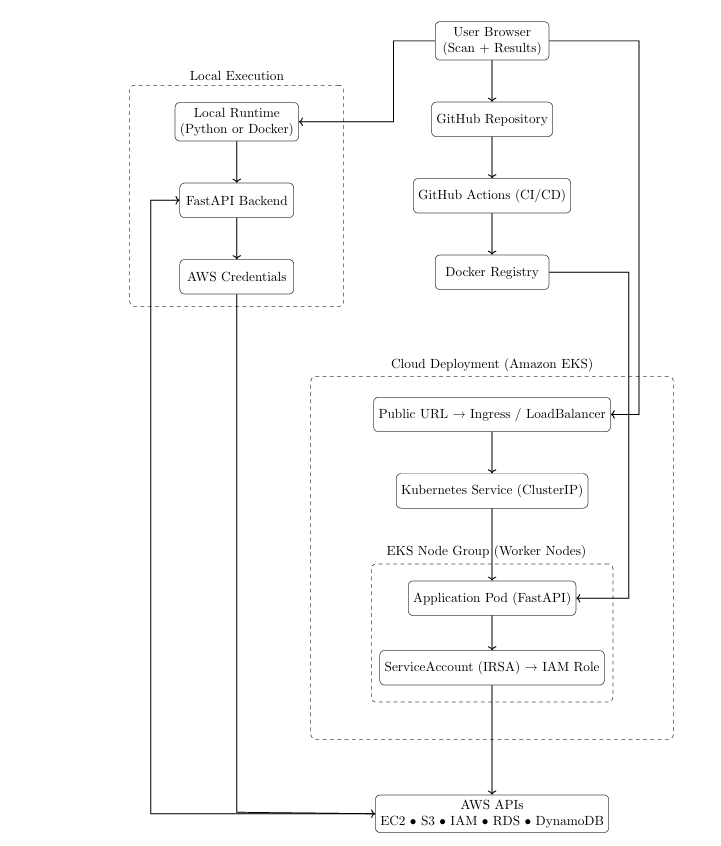

# INFRACONTROL – A CLOUD-NATIVE AWS INFRASTRUCTURE VISIBILITY AND SECURITY ANALYSIS PLATFORM

---

## Project Documentation

**Click here to read the full project report:**
[Open InfraControl Project Report](./InfraControl.pdf)

---

## About the Project

Cloud infrastructure is the backbone of modern software systems, enabling scalability, reliability, and cost efficiency.
However, managing and monitoring cloud resources across regions is still challenging, especially for students, small teams, and organizations without centralized visibility tools.

**InfraControl** is a cloud-native application designed to scan and analyze AWS infrastructure resources such as **EC2, S3, Lambda, DynamoDB, IAM, and VPC** across multiple regions.
The system presents results through a **web-based dashboard** that shows:

* Configuration risks
* Resource inventory
* Regional distribution
* Service usage in real time using AWS APIs

The platform demonstrates **real-world cloud engineering practices**, including:

* Containerized deployment with **Docker**
* Kubernetes orchestration on **AWS EKS**
* Infrastructure as Code using **Terraform**
* Secure IAM-based access control with **IRSA**
* Automated **CI/CD pipeline** using GitHub Actions

---

## Key Features

* Finds AWS resources across multiple regions
* Shows configuration details and possible security issues
* Provides a single dashboard to view all infrastructure in real time
* Built using containers and designed for cloud environments
* Supports automated deployment using DevOps practices

---

## Architecture



---

## Technology Stack

### Backend

* FastAPI (Python) for API development
* AWS SDK **Boto3** for interacting with AWS services

### Frontend

* HTML, CSS, and JavaScript for user interface

### Cloud & DevOps

* Docker for containerization
* Kubernetes (**AWS EKS**) for orchestration
* Terraform for Infrastructure as Code
* IAM & IRSA for secure access control
* GitHub Actions for CI/CD automation

### AWS Services Observed

* EC2, S3, IAM, RDS, DynamoDB, Lambda, VPC

---

## Run Using Docker

### Configure AWS credentials on your machine

```bash
aws configure
```

Enter:

* AWS Access Key
* AWS Secret Key
* Region (example: us-east-1)
* Output format (json)

---

### Pull and run the Docker container

```bash
docker pull saikoushik1/infracontrol:latest
docker run -p 8000:8000 -v ~/.aws:/root/.aws saikoushik1/infracontrol:latest
```

---

### Open in browser

```
http://localhost:8000
```

> The scan uses AWS credentials configured on the **host machine**.

---

## Screenshots

Project execution screenshots are available in the **screenshots/** directory.

---

## Author

**Chepyala Sai Koushik**

**Java | Cloud | DevOps**